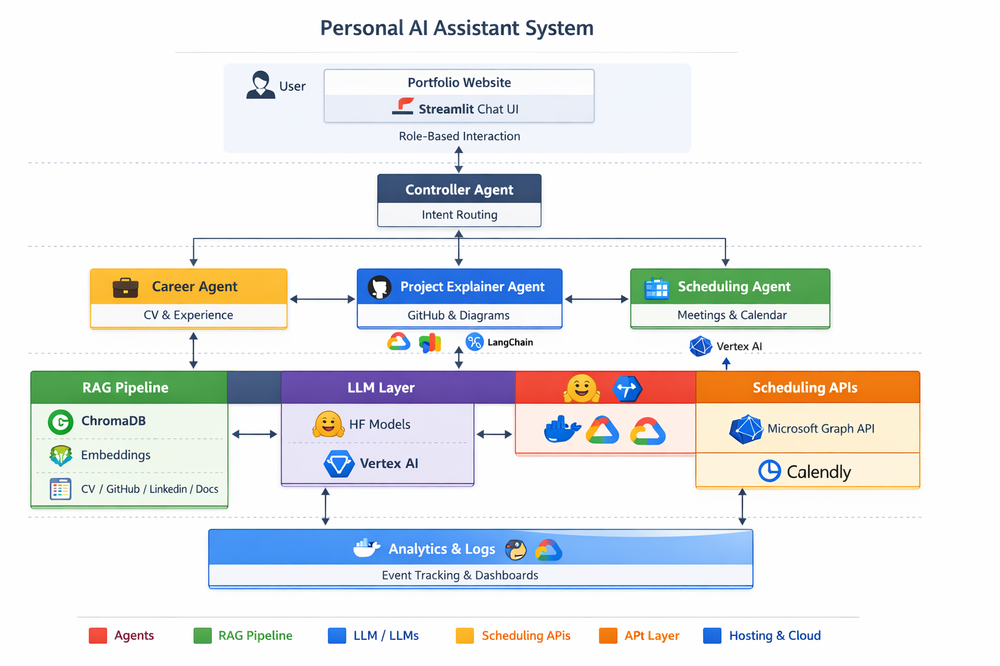

#  Personal AI Assistant (Multi-Agent RAG System)
**🔗 Live Demo:** [https://huggingface.co/spaces/Stephen0111/personal-ai-assistant](https://huggingface.co/spaces/Stephen0111/personal-ai-assistant)


---

##  Overview

This project is a cloud native **multi-agent, retrieval-augmented, analytics-enabled personal AI assistant** embedded into a portfolio website.

It is designed to act as a **24/7 intelligent representative**, capable of:
- Answering recruiter questions about my experience
- Explaining my projects in depth
- Demonstrating real AI engineering capabilities
- Converting visitors into scheduled meetings

This system showcases **production-grade AI architecture**, combining:
- Multi-agent orchestration
- Retrieval-Augmented Generation (RAG)
- Event-driven data pipelines
- Cloud deployment
- Full observability & analytics

---

##  Features

###  Smart Portfolio Assistant
- Streamlit-based chatbot UI
- Role-based responses (Recruiter, Engineer, Hiring Manager, Student)
- Explainability mode (retrieval + reasoning transparency)
- Interactive project explorer

---

###  Multi-Agent Architecture
- **Controller Agent** → Intent classification & routing
- **Career Agent** → CV & experience Q&A
- **Project Explainer Agent** → GitHub repo analysis & diagrams
- **Scheduling Agent** → Meeting booking (Teams / Calendly)

---

###  Retrieval-Augmented Generation (RAG)
- Vector database: **ChromaDB**
- Embeddings: **Sentence Transformers**
- Data sources:
  - CV
  - GitHub repositories
  - LinkedIn content
  - Project documentation

---

###  Intelligent GitHub Ingestion
- **Event-triggered ingestion (primary)**
  - Auto-runs when a new repo is created
  - Pulls README + files
  - Generates embeddings
  - Updates vector DB

- **Monthly fallback ingestion**
  - Full re-index for consistency
  - Ensures no missed updates

---

###  Analytics & Observability
- Event tracking (questions, sessions, clicks)
- LLM metrics (latency, token usage, tool calls)
- RAG analytics (retrieval quality, unused chunks)
- Feedback loop (👍 / 👎)
- Recruiter funnel tracking
- Streamlit analytics dashboard

---

###  Scheduling Integration
- Microsoft Graph API (Teams meetings)
- Calendly API
- Automated booking workflows

---

##  Architecture Overview



---

##  System Design

###  High-Level Flow

1. User interacts with Streamlit UI
2. Controller Agent classifies intent
3. Query routed to appropriate agent
4. Agent retrieves context via RAG
5. LLM generates response
6. Optional tool/API calls executed
7. Response returned + analytics logged

---

##  Tech Stack

| Layer | Technology |
|------|-----------|
| Frontend | Streamlit/React |
| Backend | Python, FastAPI (optional) |
| Agent/Framework| LangChain,LangGraph,LlamaIndex |
| Vector DB | ChromaDB/Pinecone |
| Embeddings | Sentence Transformers |
| LLMs | Hugging Face (Mistral, Zephyr), Vertex AI |
| Scheduling | Microsoft Graph API, Calendly |
| Cloud | GCP (Cloud Run, Storage) |
| Automation | GitHub Webhooks, Cloud Scheduler |
| Containerization | Docker |

---

##  Multi-Agent Architecture

### Controller Agent
- Intent classification
- Routes queries to appropriate agent
- Maintains conversation context

### Career Agent
- Answers questions about:
  - Experience
  - Skills
  - Career trajectory
- Uses CV + LinkedIn RAG

### Project Explainer Agent
- Analyzes GitHub repositories
- Explains:
  - Architecture
  - Code structure
  - Design decisions
- Can generate diagrams dynamically

### Scheduling Agent
- Handles:
  - Availability queries
  - Booking workflows
- Integrates with:
  - Microsoft Graph API
  - Calendly

---

##  RAG Pipeline

### Data Sources
- CV text
- GitHub repositories
- LinkedIn content
- Project documentation

### Pipeline Steps
1. Data ingestion
2. Chunking
3. Embedding generation
4. Storage in ChromaDB
5. Semantic retrieval at query time

---

##  GitHub Ingestion Workflow

###  Primary Trigger (Event-Driven)
- Triggered when:
  - New repository is created
- Steps:
  - Fetch metadata
  - Pull README + files
  - Chunk + embed content
  - Update vector DB

###  Fallback (Monthly Refresh)
- Full re-index of all repositories
- Ensures:
  - Data consistency
  - Recovery from missed events

###  Why This Approach?
- Minimizes cost (only process changes)
- Keeps system up-to-date
- Demonstrates production-grade pipeline design

---

##  Scheduling Workflow

1. User requests meeting
2. Scheduling Agent detects intent
3. Fetches availability via API
4. Creates meeting:
   - Microsoft Teams (Graph API)
   - or Calendly
5. Confirms booking in chat

---

##  Analytics & Observability

### Event Tracking
- Questions asked
- Session duration
- Project views
- Booking attempts

### LLM Metrics
- Token usage
- Latency
- Tool invocation frequency

### RAG Metrics
- Retrieved vs unused documents
- Retrieval accuracy
- Failure cases

### Funnel Tracking
Landing → Chat → Project View → Meeting Booked
### Dashboard
- Built in Streamlit
- Visualizes:
  - Usage patterns
  - Conversion metrics
  - System performance

---

##  Local Development

### Prerequisites
- Python 3.10+
- pip / virtualenv
- Git

### Setup

```bash
git clone https://github.com/Stephen0111/personal-ai-assistant.git
cd personal-ai-assistant

python -m venv venv
source venv/bin/activate  # macOS/Linux
venv\Scripts\activate     # Windows

pip install -r requirements.txt
streamlit run app.py
